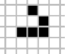
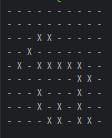

# **Game of Life exercise**  

## Definition

The universe of the Game of Life is an infinite two-dimensional orthogonal grid of square cells, each of  which is in one of two possible states, alive or dead. Every cell interacts with its eight neighbors, which  are the cells that are horizontally, vertically, or diagonally adjacent.  

## Rules
At each step in time, the following transitions occur:
1. Any live cell with fewer than two live neighbors dies as if caused by underpopulation.
2. Any live cell with two or three live neighbors lives on to the next generation.  
3. Any live cell with more than three live neighbors dies, as if by overcrowding.  
4. Any dead cell with exactly three live neighbors becomes a live cell, as if by reproduction.

The initial pattern constitutes the seed of the system. The first generation is created by applying the  above rules simultaneously to every cell in the seed—births and deaths occur simultaneously, and the  discrete moment at which this happens is sometimes called a tick (in other words, each generation is a  pure function of the preceding one). The rules continue to be applied repeatedly to create further  generations.  

## Objectives
1. Implement the game of life data structures and algorithm.
2. Demonstrate that game of life algorithm works.

## Hints  
   * To demonstrate that the program works you can print out the state of the universe to the  console/output after each generation. There is no need to build a custom UI.  
   * The program must run and work properly (the working program is better than in-progress  design).  
   * Use the ‘Glider’ pattern placed in the middle of the 25x25 cell universe for demonstration

## Execution

### Notice: PHP 8.1 is a minimal required version for running the game

Before running the game, you need install the dependencies:

    composer install

For run the game specify in the terminal:

    ./play

OR

    php play.php

and click `Enter`.

The game will be ended automatically if all cell are dead.

## Game configurations

The default configuration are in the file `configs/game.php`.
There is a list of possible parameters:
* `grid_size` - The size (height/width) of a gaming grid
* `first_gen_alive_probability` - The density of living cells in the first generation
* `gen_duration` - The time of life of the generation (in seconds)
* `game_cycle` - This parameter determines the number of game iterations (in this context - generations). **Only an integer can be specified**. `0` means infinite number of iterations

You can change settings in a file or directly via command line arguments.

Arguments:
* `size` - grid_size
* `dens` - first_gen_alive_probability
* `dur` - gen_duration
* `cycle` - game_cycle

For example:

    ./play --size=10 --cycle=3 dens="0.5"

Output:

